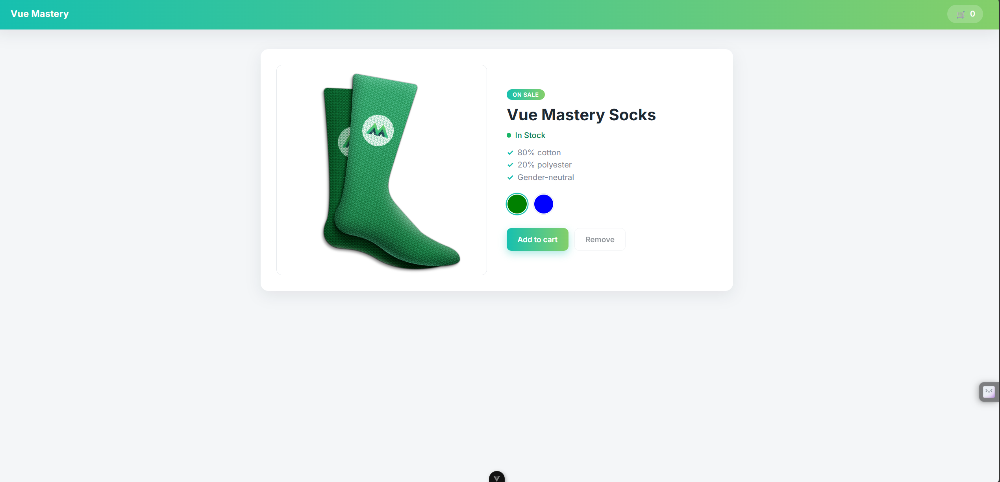

# Product App

> A Product Page in Vue



An interactive product page built with Vue 3, Vite and TypeScript. It features
variant selection via color swatches, live stock status, an on-sale badge and a
simple add/remove cart counter.

## Built With

- HTML, CSS, TypeScript
- Vue 3 (Composition API, `<script setup>`)
- Vite

## Live Demo

[Live Demo Link](https://livedemo.com)


## Getting Started

To get a local copy up and running follow these simple example steps.

### Prerequisites

- [Node.js](https://nodejs.org/) `^20.19.0 || >=22.12.0`
- npm (bundled with Node.js)

### Setup

Clone the repository to your local machine:

```sh
git clone https://github.com/githubhandle/product-app.git
cd product-app
```

### Install

Install the project dependencies:

```sh
npm install
```

### Usage

Start the development server with hot-reload:

```sh
npm run dev
```

Then open the printed local URL (default `http://localhost:5173`) in your browser.

### Run tests

This project has no automated tests yet. Type safety is enforced during the
build via `vue-tsc`:

```sh
npm run type-check
```

### Deployment

Type-check, compile and minify for production, then preview the output:

```sh
npm run build
npm run preview
```

The production-ready files are generated in the `dist/` directory.


## Authors

👤 **Author1**

- Github: [@githubhandle](https://github.com/githubhandle)
- Twitter: [@twitterhandle](https://twitter.com/twitterhandle)
- Linkedin: [linkedin](https://linkedin.com/linkedinhandle)

👤 **Author2**

- Github: [@githubhandle](https://github.com/githubhandle)
- Twitter: [@twitterhandle](https://twitter.com/twitterhandle)
- Linkedin: [linkedin](https://linkedin.com/linkedinhandle)

## 🤝 Contributing

Contributions, issues and feature requests are welcome!

Feel free to check the [issues page](issues/).

## Show your support

Give a ⭐️ if you like this project!

## Acknowledgments

- Hat tip to anyone whose code was used
- Inspiration
- etc

## 📝 License

This project is [GPL](lic.url) licensed.
